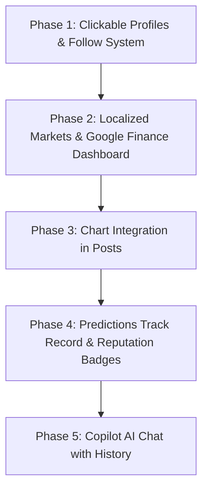

# Implementation Plan — Social Financial Intelligence Platform (Mnemo / Axiom)

This plan outlines the roadmap to transform Mnemo from a simple social text feed into a premium, gamified **Social Financial Intelligence layer** tailored for both global and emerging markets (like BRVM, BVMAC, JSE). We will execute this transition step-by-step.

---

## Proposed Roadmap

---

## Phase 1: Clickable Profiles & Follow System (The Social Core)

The core social loop is currently blocked because users cannot click profiles, view other traders' posts, or follow each other. Phase 1 establishes these vital connections.

### Proposed Changes

#### 1. Clickable Links in the Feed & Leaderboard
* Wrap user avatars, display names, and `@handles` inside `Link` elements pointing to `/user/[handle]`.
* **Files to modify**:
  * [PostCard.tsx](file:///c:/Users/DELL/Desktop/cinematic_pipeline/src/components/feed/PostCard.tsx) (inside feed)
  * [LeaderboardTable.tsx](file:///c:/Users/DELL/Desktop/cinematic_pipeline/src/components/trading/LeaderboardTable.tsx) (inside leaderboard)
  * [ExplorePage](file:///c:/Users/DELL/Desktop/cinematic_pipeline/src/app/(app)/explore/page.tsx) (inside "Who to follow" section)

#### 2. Create User Profile Page
* **Route**: `[NEW]` [page.tsx](file:///c:/Users/DELL/Desktop/cinematic_pipeline/src/app/(app)/user/[handle]/page.tsx)
* **Features**:
  * Render profile header: Avatar, Display Name, `@handle`, Bio, and Follow/Unfollow button.
  * Render metrics count: Followers, Following, Posts, and accuracy score.
  * Tabs to switch between:
    * **Posts**: Feed showing only this user's posts.
    * **Portfolio**: Read-only view of their current paper positions and historical trades.
    * **Predictions**: Active market predictions and historical accuracy.

#### 3. Database Follow Actions
* Create API route for follow/unfollow: `[NEW]` [route.ts](file:///c:/Users/DELL/Desktop/cinematic_pipeline/src/app/api/user/[handle]/follow/route.ts)
* Reads the logged-in user and writes to/removes from the `follows` table in Supabase.
* Falls back to a mock/in-memory database in demo mode to prevent crashing.

---

## Phase 2: Localized Markets & Google/Yahoo Finance Dashboard

We will expand our universe to support emerging markets (like **BRVM**, **BVMAC**, **JSE**) and redesign the market views to feel like a premium trading dashboard.

### Proposed Changes

#### 1. Localize Universe & Auto-detection
* Update [universe.ts](file:///c:/Users/DELL/Desktop/cinematic_pipeline/src/lib/universe.ts) to include local indices and stocks (e.g. `$BRVMc`, `$JSE`, `$BVMAC`).
* Implement a regional selection widget (e.g. **US**, **West Africa (BRVM)**, **South Africa (JSE)**, **Central Africa (BVMAC)**) to prioritize local ticker strips and indexes based on the user's location.

#### 2. Sparklines & Premium Dashboard Layout
* Redesign the market list interface to match Google Finance or Yahoo Finance aesthetics.
* Replace the current 3D viz with a high-performance **interactive technical chart** using lightweight charts, showing clear price actions, valuations, and earnings calendars.
* Render small, interactive sparkline charts next to indices in the sidebar/right rail.

---

## Phase 3: Chart Integration in Posts (Rich Financial Media)

Posts should not be just text. When a trader tags a symbol (e.g., `$AAPL`), we should render the corresponding stock trend chart directly inline within the post body.

### Proposed Changes
* Update [PostCard.tsx](file:///c:/Users/DELL/Desktop/cinematic_pipeline/src/components/feed/PostCard.tsx) to automatically detect cashtags and fetch a lightweight mini-chart for the first tagged symbol.
* Embed a collapsible sparkline/candlestick card directly beneath the post body.

---

## Phase 4: Predictions Track Record & Reputation Badges

Users build trust by being right, not by having flashy badges. We will implement FNV-1a deterministic or database-backed prediction scoring.

### Proposed Changes
* When a user creates a post and selects a sentiment (Bullish/Bearish) along with a cashtag:
  * Prompt the user to set a price target and timeline (horizon: 1d, 1w, 1m).
  * Lock in the prediction in the `predictions` database table.
* Calculate the accuracy percentage and alpha return relative to the benchmark index (S&P 500 or BRVM index).
* Display badges (Bronze, Silver, Gold, Top 1% Analyst) next to their username in the feed and leaderboard based on their verified historical accuracy.

---

## Phase 5: AI Copilot Chat Assistant with History

An interactive sidebar or full-page chat interface where users can consult the AI financial assistant for market analyses.

### Proposed Changes
* Build a persistent chat panel that has access to current market data, sentiments from recent posts, and company profiles.
* Enable conversation history saved to Supabase auth user storage.

---

## Verification Plan

### Automated Tests
- Run Next.js compilation: `npm run build`
- Run typescript typecheck: `npm run typecheck`

### Manual Verification
1. Click on user handles in the home feed and verify navigation to `/user/[handle]`.
2. Toggle follow and unfollow buttons, checking that the counts update reactively and write to the database.
3. Test signup with "Confirm Email" disabled to verify instant logging.

---

## Open Questions for the User

> [!IMPORTANT]
> 1. **Emerging Market Feed Prices**: Should we pull BRVM/BVMAC prices using a live provider API (if you have one) or simulate realistic market behaviors for local exchanges using our seeded deterministic generator?
> 2. **Portfolio Privacy**: Do you want user portfolios on profiles to be completely public by default (so other traders can copy-trade/verify), or should we include a privacy toggle to hide holdings?
> 3. **AI Provider**: For the AI prediction analysis and copilot, do you prefer to start with the free **Gemini API** key we discussed, or keep it mocked for now?
